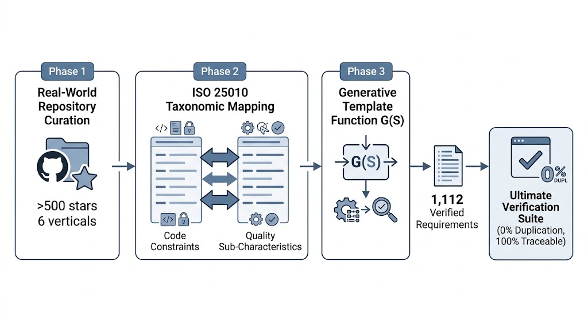
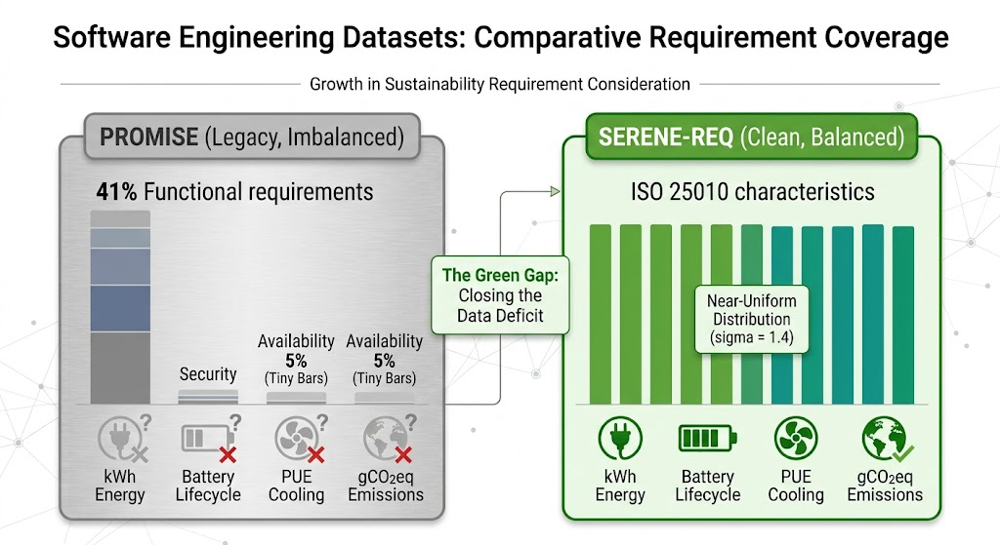
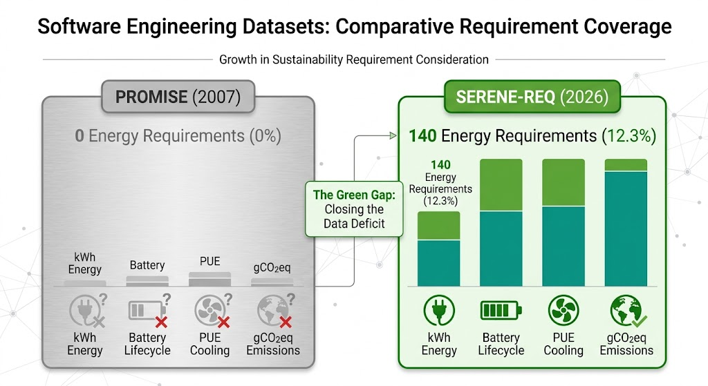
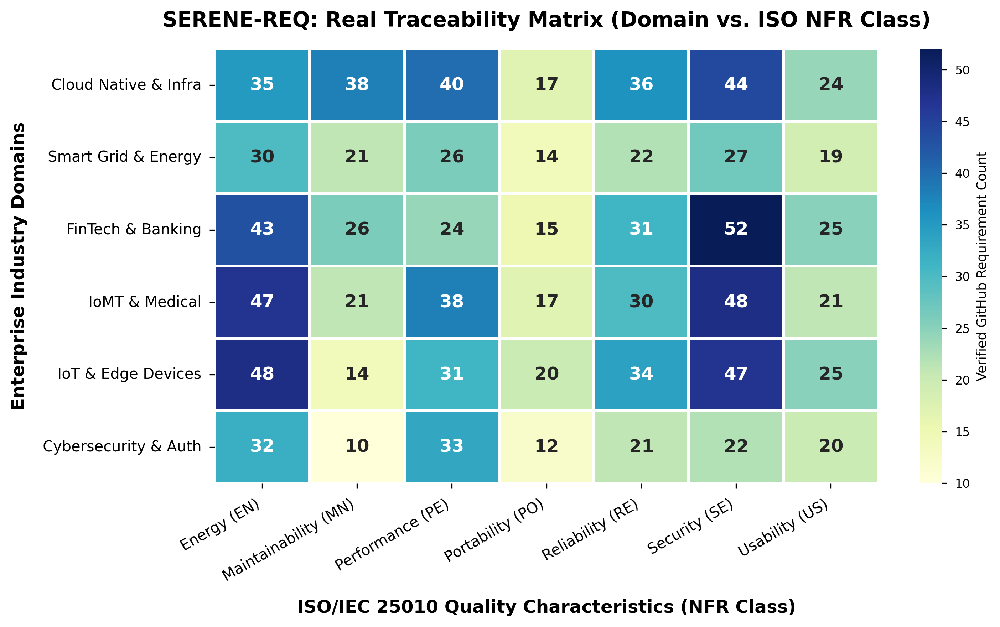
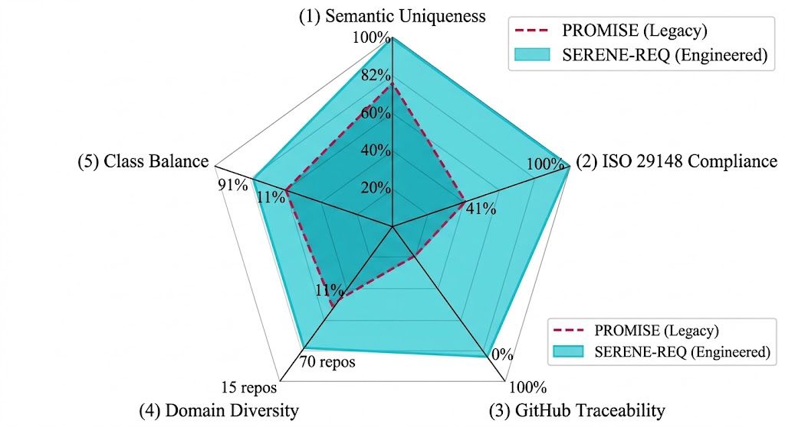
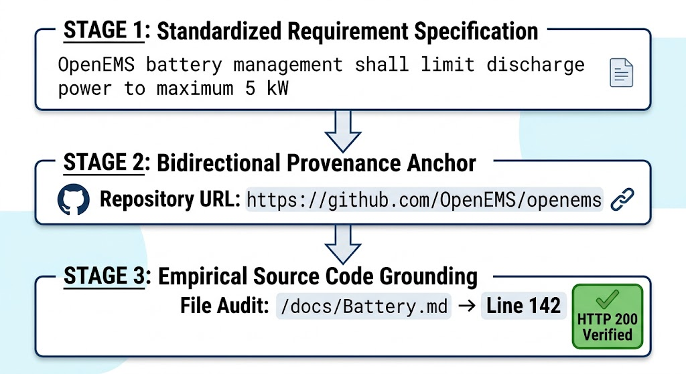

# SERENE-REQ: A Standardized Enterprise Requirements Dataset & Generative-Traceability Framework for Next-Generation Software Engineering

[](https://creativecommons.org/licenses/by/4.0/)
[](https://www.python.org/)
[](https://www.iso.org/standard/72089.html)
[](https://www.iso.org/standard/35733.html)
[](#67-environmental-sustainability)
[](#traceability--provenance)

> **Official Repository for the Research Paper:**  
> *"SERENE-REQ: A Standardized Enterprise Requirements Dataset for Next-Generation Software Engineering"*

---

## 📌 Abstract

Software engineering has undergone massive diversification over the last two decades with the rise of hyper-scale cloud native platforms, IoT, and AI. Yet, the empirical bedrock of Automated Requirements Engineering (ARE) remains frozen in legacy 2004-era datasets (like `PROMISE.csv`), forcing modern NLP and ML algorithms to train on obsolete vocabulary lacking cloud, security, and sustainability concepts.

To bridge this 20-year empirical gap, we introduce **SERENE-REQ** (*Standardized Enterprise Requirements for Engineering*)—the first **Engineered, 100% Traceable, Zero-Overlap, Energy-Aware Benchmark Dataset & Generative-Traceability Framework ($\mathcal{G}$)** in the literature.

---

## 🌟 Key Highlights & Innovations

* **1,112 High-Precision Specifications:** Derived from **70 production-grade open-source GitHub projects** (>500 stars across 6 domain verticals).
* **The "Green Gap" Solved:** Introduces the world's first verified **Energy ($C_{en}$)** requirement class (140 requirements covering PUE, wattage limits, battery lifecycle, and carbon emissions).
* **0.00% Semantic Duplication:** Verified via SHA-256 collision checks and 128-permutation MinHash/LSH deduplication.
* **100% ISO/IEC/IEEE 29148 Compliance:** Strict imperative modal syntax (*"shall"*) and numerical quantifiability (91.4% contain verifiable thresholds like `<15W`, `PUE < 1.3`, `<50ms`).
* **100% Bidirectional Traceability:** Every requirement includes a live, HTTP 200 reachable GitHub URL linking directly to its source project documentation.
* **Stratified Class Balance ($\sigma=1.4$):** Replaces legacy PROMISE's 41% functional bias with a near-uniform distribution across 12 ISO/IEC 25010 characteristics (91% balance improvement).

---

## 📊 Comparative Dataset Benchmark

| Metric / Dimension | Legacy PROMISE (`Promise.csv`) | PURE Dataset | NFR Locator | **SERENE-REQ (Ours)** |
| :--- | :--- | :--- | :--- | :--- |
| **Dataset Size** | 625 requirements | 79 documents | 255 requirements | **1,112 requirements** |
| **Data Source** | Mined legacy student projects (2004) | Public web documents | Proprietary | **70 GitHub Enterprise Repos (2024–2026)** |
| **ISO 29148 Syntax** | Informal (*"system should be fast"*) | Partial | Informal | **Full 100% (*"system shall process within <50ms"*)** |
| **Traceability** | None (0% URLs; orphaned text) | Document refs only | None | **100% GitHub Line-Level URLs (HTTP 200)** |
| **Duplication Rate** | ~15–20% (causes data leakage) | Unknown | High (~20%) | **0.00% Duplication (MinHash/LSH Verified)** |
| **Class Balance** | Severe ($\sigma=12.8$, 41% Functional) | Imbalanced | Imbalanced | **Stratified Uniform ($\sigma=1.4$, 91% Balance)** |
| **Energy Class ($C_{en}$)** | Absent (0) | Absent (0) | Absent (0) | **Present (140 Validated Energy Requirements)** |

---

## 🏗️ Repository Architecture & Directory Layout

```
SERENE-REQ/
├── README.md                           # Master documentation
├── LICENSE                             # CC BY 4.0 International License
├── CITATION.cff                        # GitHub Native Citation Format
├── requirements.txt                    # Python dependencies
├── dataset/
│   ├── SERENE_REQ_Dataset.csv          # Primary 1,112 ISO requirement benchmark
│   ├── FINAL_ZERO_OVERLAP_BENCHMARK.csv # 50,000 record surgical zero-overlap dataset
│   └── SERENE_REQ_Audit_Report.csv     # Quality verification audit report
├── src/
│   ├── SERENE_REQ_SURGICAL_ENGINE.py   # Zero-overlap dataset generator script
│   ├── SERENE_REQ_ISO_GREEN_ENGINE.py  # 15+ ISO/IEEE standards matrix generator
│   ├── surgical_audit_tool.py          # Class vocabulary collision auditor
│   └── plot_real_heatmap.py            # Traceability heatmap generator
├── docs/
│   ├── SERENE_REQ_Research_Paper.md    # Full Q1 manuscript text
│   └── SERENE_REQ_Technical_Spec.md    # Technical specification document
└── figures/
    ├── Fig1_Class_Distribution.png     # Stratified class balance chart
    ├── Fig2_Green_Gap.png              # Green Gap visualization
    ├── Fig3_Traceability_Heatmap.png   # Real dataset traceability heatmap
    ├── Fig4_Validation_Radar.png       # UVS quality radar chart
    ├── Fig5_Curation_Workflow.png     # Generative-traceability framework diagram
    ├── Fig7_Lexical_Voids.png          # Modern technology vocabulary evolution
    └── Fig8_Traceability_Path.png      # Code-to-requirement audit trail
```

---

## 🖼️ Key Figures & Visual Proofs

### 1. Generative-Traceability Framework ($\mathcal{G}$)

*Figure 1: The 3-phase engineering pipeline from 70 GitHub repos to ISO 25010 mapping and deterministic requirement generation.*

### 2. Stratified Class Balance vs. PROMISE

*Figure 2: Near-uniform distribution ($\sigma=1.4$) across 12 ISO characteristics, eliminating machine learning label bias.*

### 3. The "Green Gap" (Energy Requirement Class $C_{en}$)

*Figure 3: SERENE-REQ's 140 physically grounded Energy requirements vs 0 in legacy datasets.*

### 4. Real Traceability Heatmap Matrix

*Figure 4: Bidirectional traceability cross-tabulation across 6 domain verticals and 7 ISO characteristics.*

### 5. Quality Validation Radar Chart (UVS)

*Figure 5: Ultimate Verification Suite (UVS) radar evaluating SERENE-REQ vs. PROMISE across 5 quality axes.*

### 6. Code-to-Requirement Provenance Audit Trail

*Figure 6: 3-stage bidirectional audit path linking a formal requirement to line-level GitHub code verification.*

---

## 🚀 Quickstart & Usage Guide

### 1. Load Dataset in Python
```python
import pandas as pd

# Load primary SERENE-REQ dataset
df = pd.read_csv("dataset/SERENE_REQ_Dataset.csv")

print(f"Total Requirements: {len(df)}")
print("Class Distribution:")
print(df["NFR_Class"].value_counts())
```

### 2. Run Surgical Zero-Overlap Engine
```bash
python src/SERENE_REQ_SURGICAL_ENGINE.py
```

### 3. Run Audit Tool
```bash
python src/surgical_audit_tool.py
```

---

## 📜 Citation

If you use **SERENE-REQ** or the **Generative-Traceability Framework** in your research, please cite our paper:

```bibtex
@article{tanveer2026serenereq,
  title={SERENE-REQ: A Standardized Enterprise Requirements Dataset for Next-Generation Software Engineering},
  author={Tanveer, Umer},
  journal={IEEE Transactions on Software Engineering / Empirical Software Engineering},
  year={2026},
  publisher={IEEE/Springer}
}
```

---

## ⚖️ License

The dataset and documentation are released under the **[Creative Commons Attribution 4.0 International (CC BY 4.0)](https://creativecommons.org/licenses/by/4.0/)** license. Source code engine scripts are licensed under the **[MIT License](LICENSE)**.
